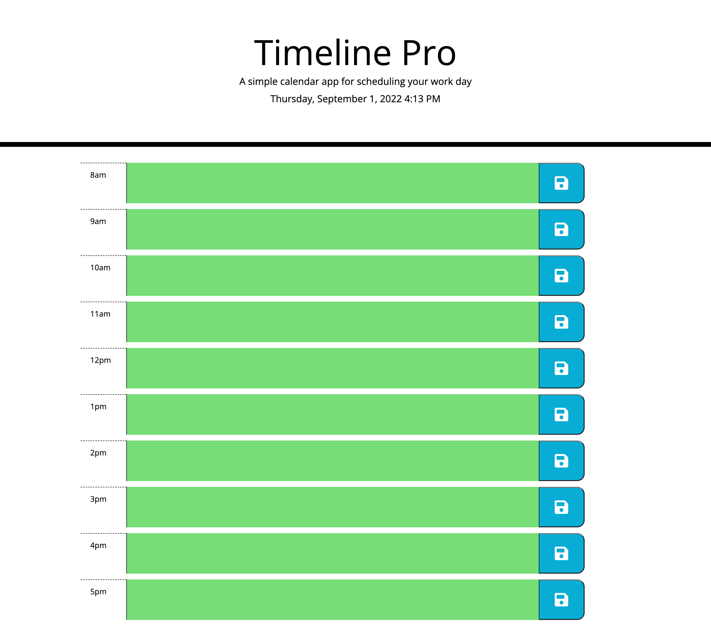

# Timeline Pro

aka Work Day Scheduler is a webpage to properly plan your work hours and free time. The page uses a combination of Bootstrap, Moments.js and Google fonts with the given started code. I implemented jQuery with Bootstrap and Moments.js to add the header date and the main body content by adding divs and appending them to the div/class conatiner. Below there a sample image and a direct link to the page.

# Screenshot

# URL for website

[Scedule your day!](https://jblay10.github.io/Timeline-Pro/)

[Backup Link...](https://jblay10.github.io/Timeline-Pro/index.html)
